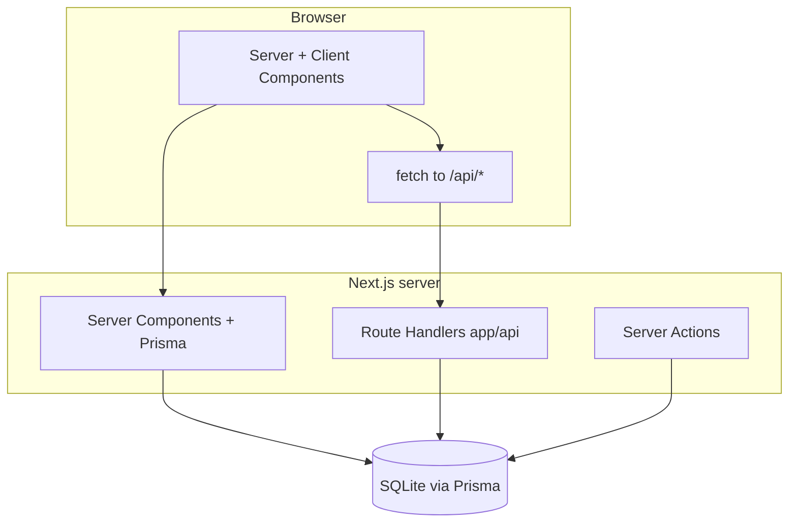

# API routes, pages, and data flow

This document maps **URLs**, **Route Handlers**, **Server Actions**, and **direct Prisma usage** so you can see how data moves through the system.

### Plain language

**URLs like `/api/...` are not a different website.** They are **entry doors inside the same Next.js app** that return JSON (or redirects) instead of a full HTML page. The browser uses them when something interactive needs fresh data without replacing the whole screen.

**Not everything uses those doors.** Many pages load data **while building HTML on the server** (no `/api` involved for the first load). That is why the home dashboard can feel “instant”: numbers were computed before your browser painted the page.

**Two styles of “saving” appear on purpose:** (1) **JSON POST** for rich flows like creating an invoice from the client-side form; (2) **classic form submit** for simple “add client / add service” via Server Actions. Both end in the same database.

For a fuller non-technical narrative, see **[PLAIN_LANGUAGE.md](./PLAIN_LANGUAGE.md)**.

## Routing overview (App Router)

All user-facing routes live under `app/`. The root layout (`app/layout.tsx`) wraps every page in `AppShell`, which provides sidebar, top bar, auth bootstrap (`GET /api/auth/me`), and financial notification UI.

## Authentication flows

| Step | Mechanism |
|------|-----------|
| Login | `POST /api/auth/login` — validates email/password with Prisma + bcrypt, sets httpOnly JWT cookie. |
| Session check | `GET /api/auth/me` — reads cookie, verifies JWT, returns user profile JSON. |
| Logout | `POST /api/auth/logout` — clears cookie. |
| Signup OTP | `POST /api/auth/signup/send-otp` — stores OTP in memory; `POST /api/auth/signup/verify-otp` validates and marks email verified. |
| Signup complete | `POST /api/auth/signup` — creates `User`, `Workspace`, `WorkspaceMember`, optional logo file; sets session cookie. |

**Note:** `getDefaultUserId()` in `lib/auth/getCurrentUser.ts` falls back to the **first user in the database** when no valid session exists — a **development convenience**, not a production security model.

## Route Handlers (`app/api/**/route.ts`)

| Method | Path | Purpose |
|--------|------|---------|
| GET | `/api/auth/me` | Current session user (public shape: email, names). |
| POST | `/api/auth/login` | Login; sets cookie. |
| POST | `/api/auth/logout` | Clears cookie. |
| POST | `/api/auth/signup/send-otp` | Generate OTP (in-memory). |
| POST | `/api/auth/signup/verify-otp` | Verify OTP. |
| POST | `/api/auth/signup` | Full registration + workspace + logo. |
| POST | `/api/invoices` | Create invoice (JSON body); uses `getCurrentContext()` for user/workspace. |
| POST | `/api/invoices/[id]/convert` | PROFORMA → FINAL; redirect back to invoice. |
| POST | `/api/invoices/[id]/convert-to-receipt` | Create receipt (and may synthesize payment); redirect to receipt. |
| POST | `/api/invoices/[id]/pay` | Record payment (`multipart/form-data`); update invoice; optional redirect to receipt. |
| GET | `/api/receipts/[id]` | JSON for receipt + invoice + payments (used by client views). |
| GET | `/api/revenue-trends` | Aggregated payment series (`granularity` or `focusDate`). |
| GET | `/api/payment-speed-trend` | Payment speed analytics. |
| GET | `/api/top-selling-products` | Product/service rankings. |
| GET | `/api/dashboard/alerts` | **Requires session** — timeline alerts for dashboard dock (401 if not logged in). |
| GET | `/api/search/suggest` | Typeahead across invoices, clients, services, tasks. |
| GET | `/api/tasks` | Tasks for `year` + `month` query params. |
| POST | `/api/tasks` | Create task. |
| PATCH | `/api/tasks/[id]` | Update task. |
| DELETE | `/api/tasks/[id]` | Delete task. |

Dynamic segments use Next.js 15+ style `params: Promise<{ id: string }>` in handlers.

## Server Actions (forms without REST)

These use `'use server'` and **Prisma directly** (often via a local `new PrismaClient()` in the same file — parallel to the shared singleton in `lib/prisma.ts`).

| Location | Action |
|----------|--------|
| `app/clients/new/page.tsx` | `createClient` — inserts `Client`, redirects. |
| `app/services/new/page.tsx` | `createService` — inserts `Service`, redirects. |

## Server Components that call Prisma directly

Many list pages **do not** go through `/api/*`; they run on the server and query Prisma in the page module:

| Page | Data |
|------|------|
| `app/page.tsx` (home) | Dashboard metrics, alerts, invoices, top products — heavy parallel `Promise.all` (see `getFinanceSummaryMetrics`, `buildDashboardAlerts`, etc.). |
| `app/invoices/page.tsx` | Full invoice list + overdue helper data. |
| `app/clients/page.tsx` | All clients. |
| `app/services/page.tsx` | All services. |
| `app/finance/page.tsx` | Finance-specific aggregates (if present). |

This pattern minimizes client-side fetching for first paint but duplicates query logic that also appears in API routes for widgets that poll or load after mount.

## Client-side fetching (browser)

| Consumer | Endpoint | Purpose |
|----------|----------|---------|
| `AppShell` | `GET /api/auth/me` | Hydrate sidebar auth state. |
| `RevenueTrendsSection` | `GET /api/revenue-trends` | Chart series (granularity or focus date). |
| `TopSellingProductsCard` | `GET /api/top-selling-products` | May refetch when sorting (implementation-dependent). |
| `GlobalFinancialAlertSubscriber` | `GET /api/dashboard/alerts` | Polls on an interval when user is authenticated; drives toast dock. |
| `Topbar` (search) | `GET /api/search/suggest?q=...` | Autocomplete. |
| `CreateInvoice` | `POST /api/invoices` | Submit new invoice JSON. |
| `Sidebar` logout | `POST /api/auth/logout` | Clear session. |

## Soft refresh

`components/dashboard/DashboardLiveRefresh.tsx` calls `router.refresh()` every 60 seconds so **server component data** on the home dashboard re-fetches without a full reload.

## Redirects and POST-redirect flows

Several invoice actions return **303 redirects** so HTML forms and payment flows land on the right page with query flags (e.g. `?ft_toast=`):

- Finalize proforma → invoice detail.
- Pay invoice → invoices list (partial) or receipt page (full).
- Convert to receipt → receipt detail.

## Index hook

After mutating invoices, handlers call `indexInvoiceById(id)` from `lib/search/invoiceSearch.ts`. Today this is a **no-op**, reserved for a future Elasticsearch/Algolia-style index.
