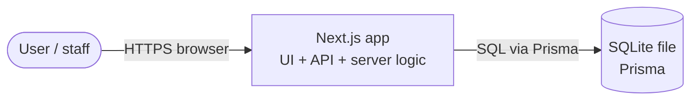
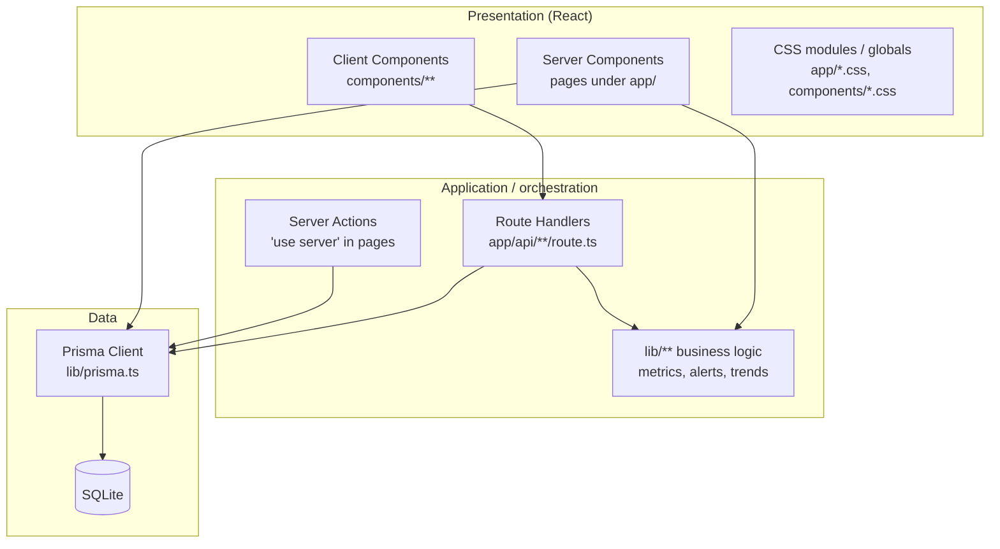
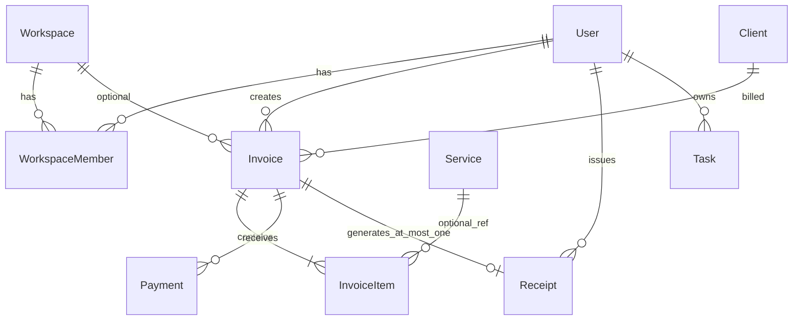
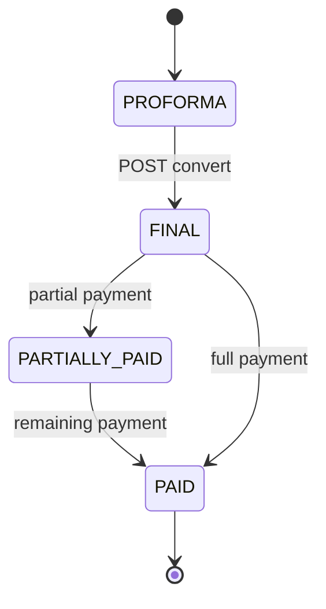
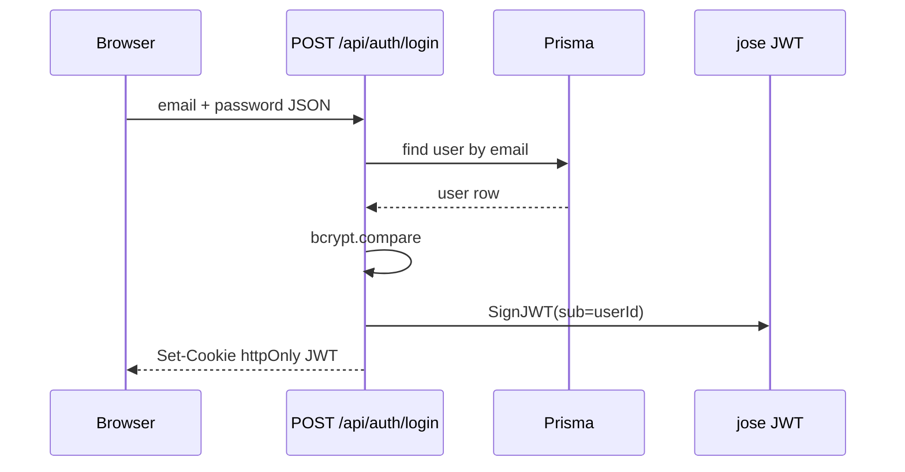

# System architecture

This document explains how the **Invoice & Financial Tracking System** is structured: layers, major modules, how the frontend and backend connect in a Next.js monolith, and how persistence and analytics fit together.

### Plain language overview

**What users experience:** They use a browser to manage clients, services, invoices, payments, receipts, tasks, and a financial dashboard. They sign in once; the app remembers them with a secure cookie. They never touch the database directly—every save and every chart goes through the application server.

**Why there is no separate “backend server” in the diagram:** In this project, “frontend” and “backend” are **two roles played by the same Next.js application**. Pages can be assembled on the server (fast first load, data already filled in). Interactive pieces run in the browser and call URLs under `/api/...` that are **also** implemented inside that same app. So you deploy **one** thing; it is not split into five microservices.

**Where the numbers come from:** Money totals, trends, and alerts are **calculated from stored invoices and payments**—sums, comparisons by date, and rules like “this invoice is overdue.” There is no magic spreadsheet; it is code in `lib/` plus queries to SQLite.

**What this document adds on top of that story:** Below, you will see precise names (Prisma, Route Handlers, JWT, etc.). Whenever that feels dense, read the companion **[PLAIN_LANGUAGE.md](./PLAIN_LANGUAGE.md)** for the same ideas in everyday language, analogies, and a jargon glossary.

> **In plain terms:** One app, one database file, one login cookie. The “API” is just extra URLs the same app exposes so the browser can ask for JSON.

## 1. Executive summary

The project is a **single Next.js application** that serves:

1. **Server-rendered pages** (React Server Components) that read/write the database through **Prisma**.
2. **HTTP JSON endpoints** (Route Handlers under `app/api`) for browser `fetch`, forms that post to URLs, and polling.
3. **Client components** for interactive UI (charts, invoice builder, sidebar, notifications).

The database is **SQLite** (file-based), accessed only from the server. There is **no** separate microservice tier; “backend” means **Next.js server runtime + Prisma**.



> **In plain terms:** You sit on the left with a browser. Everything in the middle is “the app.” The database on the right is the single place truth is stored.

## 2. Layered architecture



> **In plain terms:** “Presentation” is what you see. “Application” is the rulebook and math. “Data” is the filing cabinet. Interactive screens often **call the office** (`/api/...`) instead of opening the cabinet themselves; static-looking pages may load straight from the cabinet on the server.

### 2.1 Presentation layer

| Area | Responsibility |
|------|------------------|
| `app/**/page.tsx` | Route entries; many are **async** server components that load data and pass props to children. |
| `components/layout/*` | `AppShell` (client): sidebar, top bar, auth fetch, notification providers. |
| `components/dashboard/*` | Metrics cards, alerts panel, live refresh, overdue banners. |
| `components/finance/*` | Revenue charts, top products, invoice total card. |
| `components/invoices/*` | Table, create flow, forms, print. |
| `components/notifications/*` | Toast dock + polling subscriber for financial alerts. |

**State management:** There is **no Redux store** in application code. Client state uses **React hooks** and **React Context** (`FinancialAlertNotificationsProvider`). Theme uses `localStorage` + a small script in `layout.tsx` for dark mode.

### 2.2 Application / domain layer (`lib/`)

Key modules (non-exhaustive but representative):

| Module | Role |
|--------|------|
| `lib/auth/*` | JWT session (`jose`), cookie name, bcrypt flows, OTP in-memory store, `getCurrentContext`. |
| `lib/prisma.ts` | Singleton `PrismaClient` (dev hot-reload safe). |
| `lib/dashboardAlerts.ts` | Builds **unified alert rows** (upcoming, overdue, payments, receipts, **revenue MoM**). |
| `lib/financeSummaryMetrics.ts` | Aggregates for dashboard cards (lifetime, WoW, MoM comparisons). |
| `lib/revenueTrends.ts` | Time-bucketed payment series for charts. |
| `lib/invoiceDue.ts` | Overdue detection shared by UI and alerts. |
| `lib/search/globalSearch.ts` | Prisma-backed suggestions for the top bar. |
| `lib/dashboardAlertNotifications.ts` | Bridge to push new alerts into the client toast pipeline. |

### 2.3 Data layer

- **Schema:** `prisma/schema.prisma` defines users, workspaces, clients, services, invoices, line items, payments, receipts, tasks.
- **Migrations:** Configured under `prisma/migrations` via `prisma.config.ts`.

> **In plain terms:** The schema is the **contract** for what can be stored—like defining columns in Excel, but stricter. Migrations are **versioned changes** to that contract over time.

## 3. Domain model (conceptual ER)



**Invoice lifecycle (business states):**

- `PROFORMA` → (convert) → `FINAL` → payments → `PARTIALLY_PAID` / `PAID`.
- `CANCELLED` is available in schema; UI flows vary by page.
- **Receipt** is a separate record linked 1:1 with an invoice when payment completes or user converts manually.



> **In plain terms:** A **client** is who you bill. An **invoice** is the bill itself. **Payments** are rows saying money arrived. A **receipt** is the “we got paid” document tied to one invoice. **Services** are your catalog to speed up line items.

## 4. Authentication and authorization



- **Identity:** User id in JWT `sub`.
- **Workspace:** `getCurrentContext()` loads the user’s **first** membership’s workspace (ordered by `createdAt`). Multi-workspace switching is not exposed as a full product feature in the snippets reviewed.
- **Authorization:** Route Handlers mix **strict** checks (`getSessionClaims` for `/api/dashboard/alerts`) with **lenient** dev fallbacks (`getDefaultUserId` for tasks and some payment flows). Treat this as **technical debt** if you harden for production.

> **In plain terms:** Logging in hands you a **tamper-resistant name tag** (the JWT in a cookie). Each protected request shows the tag at the door. Some doors check strictly; others are looser during development—tighten before real customers rely on it.

## 5. Dashboard: two ways to get the same truth

The home page (`app/page.tsx`) illustrates **dual paths** to fresh data:

1. **Initial HTML:** Server Components run Prisma queries directly for metrics, alerts, and invoice table rows.
2. **After load:** Client widgets may call `/api/revenue-trends`, `/api/top-selling-products`, and `GlobalFinancialAlertSubscriber` polls `/api/dashboard/alerts`.
3. **Periodic:** `DashboardLiveRefresh` triggers `router.refresh()` every minute to re-run server components.

So the “dashboard service” is not a separate deployable — it is **shared library functions** (`buildDashboardAlerts`, `getFinanceSummaryMetrics`, …) invoked from both RSC and Route Handlers.

> **In plain terms:** The first time you open the dashboard, the server **already computed** many numbers and sent them with the page. After that, some widgets **phone home** for chart data or new alerts, and once a minute the page can **soft-refresh** so server-side numbers stay roughly current. Think: **full snapshot first**, then **light updates**.

## 6. Financial alerts and the UI card you see

`buildDashboardAlerts` aggregates:

- Upcoming and overdue invoices (using `invoiceDue` helpers),
- Recent payments and invoices,
- Recent receipts,
- **Month-over-month payment totals** to synthesize a **revenue trend** row (with `revenueTrend: 'up' | 'down'`).

The **push dock** (`FinancialAlertNotifications`) compares successive API snapshots and **toasts new alert ids**. That is how the “Revenue trend” style card can appear with a timestamp — it is **computed server-side** and **delivered** either as initial RSC props (`DashboardAlerts`) or via polling (`GlobalFinancialAlertSubscriber`).

> **In plain terms:** The app **adds up payments** for this month and last month, compares them, and turns that into a short message (e.g. “lower than last month”). If you see it pop in later, polling noticed a **new** alert row that was not there in the previous check—not a live push from a separate messaging server.

## 7. Invoice creation and mutation paths

```mermaid
flowchart LR
  subgraph Create["New invoice"]
    CI[CreateInvoice client]
    POST[POST /api/invoices]
    DB1[(Invoice + Items)]
    CI -->|JSON| POST --> DB1
  end

  subgraph Convert["Proforma → Final"]
    F[HTML form]
    C[POST /api/invoices/id/convert]
    DB2[(status FINAL)]
    F --> C --> DB2
  end

  subgraph Pay["Record payment"]
    PF[FormData POST]
    Pay[POST /api/invoices/id/pay]
    DB3[(Payment row + invoice update + optional Receipt)]
    PF --> Pay --> DB3
  end
```

- **CreateInvoice** (`components/invoices/CreateInvoice.tsx`) builds JSON and POSTs to `/api/invoices`.
- **Convert / pay** often use **server-friendly** `form` `action` or `fetch` to Route Handlers that **redirect** with flash query params.

> **In plain terms:** Creating an invoice is usually “fill the form → send JSON to the server → rows appear in the database.” Converting or paying often behaves like a **traditional web form**: submit → server updates data → **browser navigates** to the next page (invoice, list, or receipt).

## 8. Search

`/api/search/suggest` runs parallel Prisma `findMany` queries with `contains` filters — **SQLite substring search**, not full-text search. The `indexInvoiceById` hook is reserved for a future external index.

> **In plain terms:** Search looks for **text contained inside** fields (invoice number, client name, etc.). It is fine for thousands of rows; it is not tuned like Google.

## 9. Tasks module

Tasks are **per-user** (`Task.userId`). CRUD is exposed under `/api/tasks` and `/api/tasks/[id]`, scoped by `getDefaultUserId()`. The tasks UI (`app/tasks/page.tsx`) consumes these endpoints from the client.

> **In plain terms:** Tasks are your **private to-do list inside the app**, separate from invoices—same login, different table.

## 10. Static assets and uploads

- Global styles: `app/globals.css`, page-scoped CSS imports.
- User-uploaded workspace logos: written under `public/uploads/logos/` during signup (`app/api/auth/signup/route.ts`).

## 11. What this architecture optimizes for

| Strength | Trade-off |
|----------|-----------|
| One repo, one deploy, fast iteration | SQLite limits concurrent writers; not ideal for high multi-tenant write load without migration. |
| Server-first data for SEO and TTI | Some logic duplicated between RSC and API routes. |
| JWT cookie sessions | No server-side session revocation list; compromise with short TTL or refresh strategy in production. |

> **In plain terms:** This stack is **simple to build and ship**—one codebase, one database file. It trades away **massive scale** (many simultaneous writers) and some **enterprise security features** unless you add them. For a small team or internal tool, that is often the right trade.

## 12. File map (where to look)

| Concern | Primary locations |
|---------|-------------------|
| Routes & pages | `app/` |
| HTTP API | `app/api/` |
| DB schema | `prisma/schema.prisma` |
| Auth | `lib/auth/`, `app/api/auth/` |
| Dashboard math | `lib/financeSummaryMetrics.ts`, `lib/dashboardAlerts.ts`, `lib/revenueTrends.ts` |
| UI shell | `components/layout/AppShell.tsx`, `Topbar.tsx`, `Sidebar.tsx` |

For exhaustive endpoint and flow tables, see [API_AND_DATA_FLOW.md](./API_AND_DATA_FLOW.md). For packages and env vars, see [SERVICES_AND_DEPENDENCIES.md](./SERVICES_AND_DEPENDENCIES.md). For production deployment, security hardening, and scaling, see [PRODUCTION_SCALABILITY.md](./PRODUCTION_SCALABILITY.md).

### Plain language recap

The technical sections above name files and patterns; the **[PLAIN_LANGUAGE.md](./PLAIN_LANGUAGE.md)** guide tells the **same story** with analogies (showroom / office / filing cabinet), step-by-step user flows, what the app does **not** include (payment gateways, separate microservices), and a **jargon → English** glossary. Read it once for intuition, then use this document as the map back to the code.
